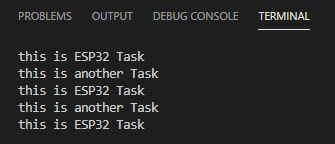

# PRÁCTICA 4A: 
## CÓDIGO DEL PROGRAMA:

```
#include <Arduino.h>

void anotherTask( void * parameter );
void setup()
{
    Serial.begin(115200);
    /* we create a new task here */
    xTaskCreate(anotherTask, "another Task", 10000, NULL, 1, NULL); /* Task handle to keep track of created task */
}
 
/* the forever loop() function is invoked by Arduino ESP32 loopTask */
void loop()
{
    Serial.println("this is ESP32 Task");
    delay(1000);
}
 
/* this function will be invoked when additionalTask was created */
void anotherTask( void * parameter )
{
    /* loop forever */
    for(;;)
    {
        Serial.println("this is another Task");
        delay(1000);
    }
    /* delete a task when finish,
    this will never happen because this is infinity loop */
    vTaskDelete( NULL );
}
```
## Salida por el puerto serie:
Después de compilar y subir el código a la ESP32, hace que al monitorearlo se muestre por pantalla dos mensajes que se muestran  a la vez. Uno se muestra des de el loop del programa y el otro se muestra mmediante el uso de una tasca. Las dos se muestran a la vez ya que en los dos, en este caso se usan como bucles infinitos al no tener ningun tipo de código que haga que tengan un final de bucle.

Mensaje por pantalla:



## Funcionameniento:
Para crear el código de este programa hemos utilzado las tascas. Primeramente es necesario crear la tasca, eso lo haremos dentro del void setup():
```
void setup()
{
    Serial.begin(115200);
    /* we create a new task here */
    xTaskCreate(anotherTask, "another Task", 10000, NULL, 1, NULL); /* Task handle to keep track of created task */
}
```
Donde en este caso:
* anotherTask: Nombre del subprograma que hay que llamar.
* another Task: Nombre del subrograma.
* 10000: Tamaño (bytes).
* NULL: Parametro a pasar.
* 1: Prioridad de la tasca (puede variar entre 1-24).
* NULL: Identificador de tareas.

Dentro del void loop(), ponemos el tiempo que va a tardar en escribir por pantalla la frase que va a printear por pantalla y también este sera el tiempo que va a tardar hacer que se ejecute el subprograma cada vex que lo termine.
```
void loop()
{
    Serial.println("this is ESP32 Task");
    delay(1000);
}
```

Seguidamente hay que hacer el código del subprograma, en este crearemos un bucle, que esta se va encargar de escribir por pantalla una frase y lo va a repetir cada vez que se haga el delay. En este caso el bucle no tiene fin, asi que no va a parar.
```
void anotherTask( void * parameter )
{
    for(;;)
    {
        Serial.println("this is another Task");
        delay(1000);
    }
    vTaskDelete( NULL );
}
```

Para que el subrograma funcione, hace falta poner la primera línea de esta para devlararlo al principio del programa (antes del void setup()).

```
void anotherTask( void * parameter );
```